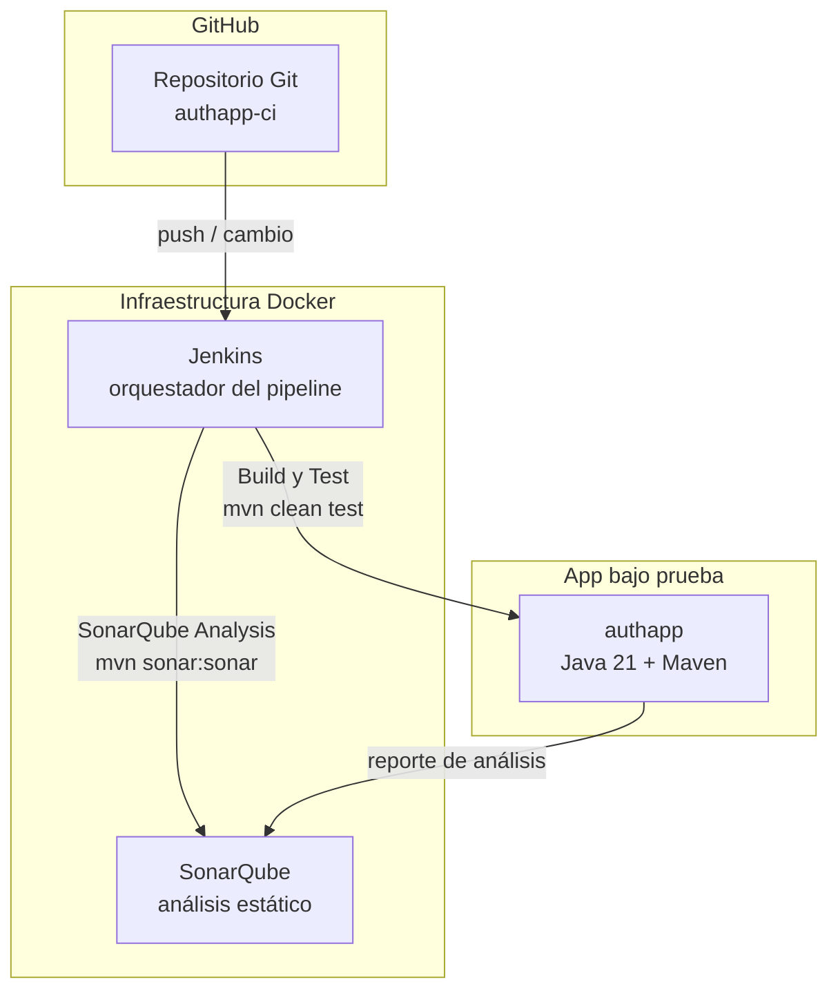
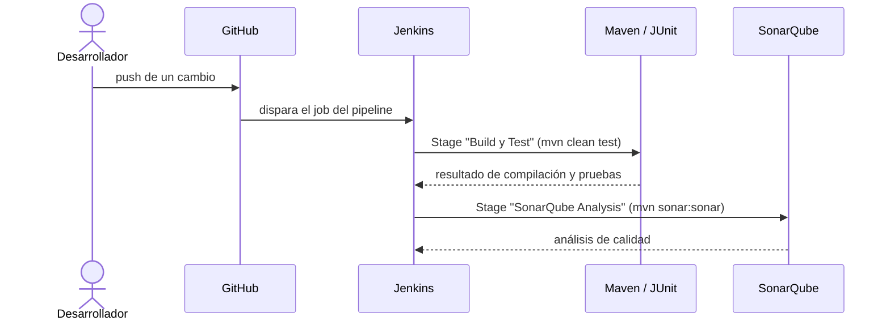

# AuthApp CI — Arquitectura

> Vista de alto nivel de cómo está construido el sistema de CI/CD y cómo se
> reparten las responsabilidades. Para el stack real (versiones, librerías) ver
> [`stack.md`](stack.md). Para el negocio ver
> [`../product/business-model.md`](../product/business-model.md).
>
> **Última actualización**: 2026-07-02

## Diagrama

## Componentes

| Componente        | Responsabilidad                                                              | Tecnología              |
| ----------------- | --------------------------------------------------------------------------- | ----------------------- |
| Repositorio Git   | Fuente de verdad del código; cada cambio (push) dispara el pipeline.         | GitHub                  |
| Jenkins           | Orquesta el pipeline declarativo: ejecuta el build, los tests y el análisis. | Jenkins (en Docker)     |
| SonarQube         | Recibe y muestra el análisis estático de calidad del código.                 | SonarQube LTS (Docker)  |
| App `authapp`     | Objeto del build; app Java/Maven trivial que se compila y testea.           | Java 21 + Maven         |

## Decisiones clave

| Decisión                                | Razón                                                                            |
| --------------------------------------- | -------------------------------------------------------------------------------- |
| Jenkins y SonarQube en Docker Compose   | Entorno reproducible y aislado, fácil de levantar para fines educativos.         |
| Pipeline en dos stages (Build/Test y Sonar) | Separa la verificación funcional (tests) del control de calidad (análisis estático). |

> El detalle y las alternativas de cada decisión relevante se registran como
> ADRs en [`../decisions/`](../decisions/README.md).

## Reglas no negociables

- Todo cambio en GitHub debe pasar por el pipeline antes de considerarse válido.
- El stage de Build y Test debe compilar y ejecutar `mvn clean test` sin fallos.

## Flujos principales

## Referencias

- [`stack.md`](stack.md) — stack tecnológico y versiones.
- [`auth.md`](auth.md) — autenticación (demo) de la app bajo prueba.
- [`../conventions/`](../conventions/README.md) — convenciones de trabajo.
