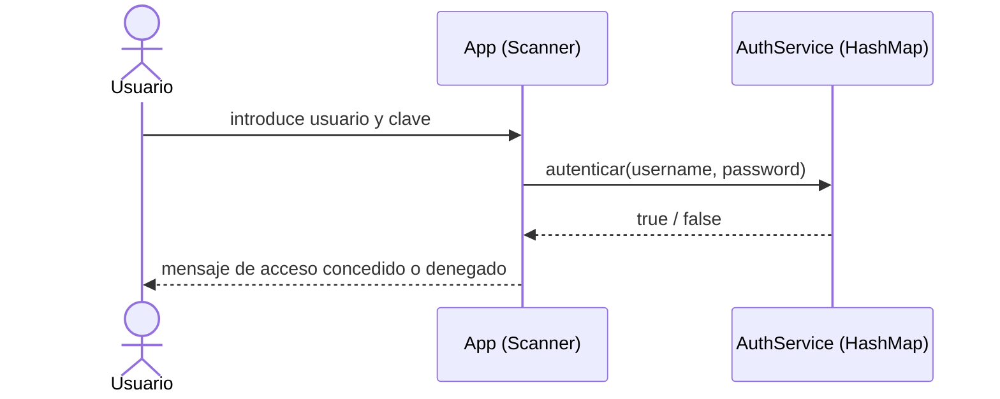

# Autenticación (demo)

> Cómo funciona el "auth" de la app **authapp** que sirve de objeto de prueba en
> el pipeline de CI/CD.
>
> **Última actualización**: 2026-07-02

> ⚠️ **Aviso**: esto es un **demo educativo**, NO un sistema de autenticación de
> producción. Existe únicamente para dar código Java real que compilar y testear
> en el pipeline.

## Visión general

- **Método de autenticación**: comparación en memoria de usuario y contraseña
  contra un `HashMap` de credenciales hardcodeadas (`admin/1234`, `user/abcd`).
- **Almacenamiento de credenciales**: en memoria, en texto plano dentro del
  código fuente (`AuthService`). No hay base de datos ni persistencia.
- **Hashing de contraseñas**: ninguno. Las contraseñas se comparan en texto plano.

## Modelo de identidad

| Concepto | Descripción                                                                    |
| -------- | ------------------------------------------------------------------------------ |
| Usuario  | Una clave (nombre de usuario) del `HashMap` con su contraseña asociada.         |
| Sesión   | No existe. El método `autenticar(username, password)` solo devuelve verdadero/falso. |
| Roles    | No existen roles ni autorización de ningún tipo.                                |

## Flujo de login

## Gestión de sesiones / tokens

- **Expiración**: no aplica. No se emiten tokens ni se crean sesiones, por lo que
  no hay TTL.
- **Renovación**: no aplica.
- **Revocación**: no aplica.

## Autorización

- **Modelo**: no hay autorización. La autenticación solo indica si las
  credenciales coinciden; no existen roles ni permisos por recurso.

## Consideraciones de seguridad

Este demo **no** es apto para producción: credenciales en texto plano, sin
hashing, sin sesiones ni tokens, sin expiración y sin persistencia.

Un sistema real debería, como mínimo:

- Hashear las contraseñas con un algoritmo lento y salado (bcrypt, argon2).
- Guardar las credenciales en un almacenamiento persistente y seguro, no en el código.
- Gestionar sesiones o tokens con expiración, renovación y revocación.

Ver [SECURITY.md](../../SECURITY.md) para la política completa.
